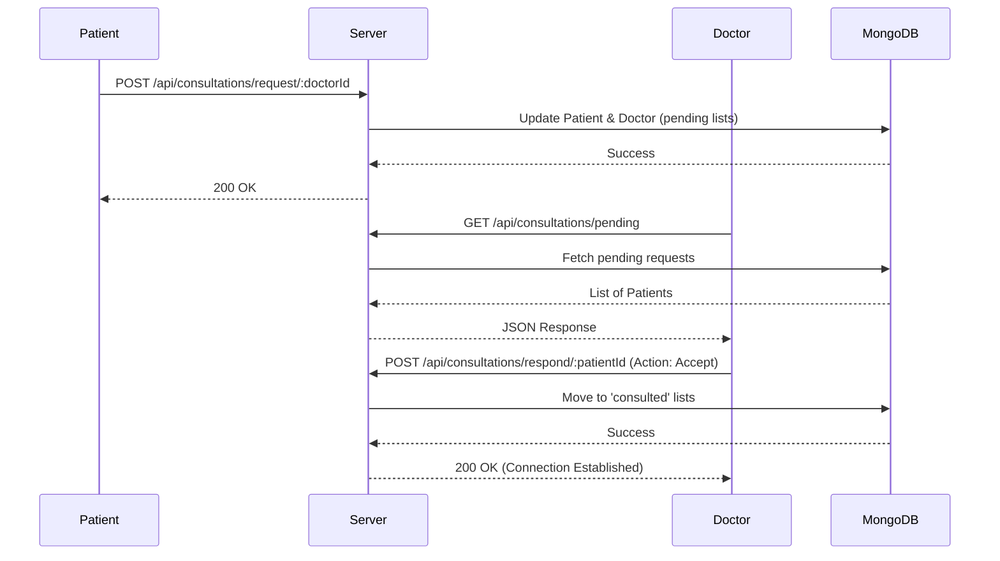

# MediCore: Intelligent Health Intelligence Platform

> **A Production-Grade MERN Stack Healthcare Solution**  
> *Secure, Scalable, and AI-Powered Patient-Doctor Collaboration*

---

## 📋 Table of Contents

1.  [Problem Statement](#-problem-statement)
2.  [Objectives](#-objectives)
3.  [Solution Overview](#-solution-overview)
4.  [Key Novelty & Features](#-key-novelty--features)
5.  [System Architecture & Integration](#-system-architecture--integration)
6.  [Technology Stack & Justification](#-technology-stack--justification)
7.  [Deep Dive: Backend Engineering](#-deep-dive-backend-engineering)
8.  [Deep Dive: Frontend Engineering](#-deep-dive-frontend-engineering)
9.  [Deep Dive: Cloud & AI Integration](#-deep-dive-cloud--ai-integration)
10. [Setup & Installation Guide](#-setup--installation-guide)
11. [Environment Variables](#-environment-variables)
12. [Deployment & DevOps](#-deployment--devops)
13. [Security Implementation](#-security-implementation)
14. [Core Workflows](#-core-workflows)
15. [API Reference](#-api-reference)
16. [Future Roadmap & Scalability](#-future-roadmap--scalability)
17. [Interview Preparation: The Ultimate Guide](#-interview-preparation-the-ultimate-guide)

---

## 🚨 Problem Statement

In the current healthcare landscape, patient data is often fragmented across disparate systems, leading to:
*   **Data Silos:** Patients struggle to maintain a consolidated history of their vitals and medical reports.
*   **Inefficient Communication:** Doctor-patient interactions are often limited to physical visits, with no streamlined digital channel for follow-ups or quick consultations.
*   **Storage Limitations:** Physical records are easily lost, and local digital storage is insecure and unscalable.
*   **Lack of Insights:** Raw data (BP, sugar levels) is rarely analyzed for trends until a critical event occurs.

## 🎯 Objectives

### Functional Objectives
*   **Centralized Health Record:** Enable patients to log vitals (BP, Sugar, Heart Rate) and upload medical files securely.
*   **Doctor-Patient Consultation:** Facilitate a request-accept model for consultations, allowing doctors to view specific patient data.
*   **Clinical Tools:** Provide doctors with tools to write notes, issue prescriptions, and view patient history.
*   **AI Assistance:** Leverage LLMs (Mistral AI) to generate concise health summaries from complex patient histories.

### Non-Functional Objectives
*   **Security:** Implement robust authentication (JWT), Role-Based Access Control (RBAC), and secure file storage.
*   **Scalability:** Use cloud-native storage (AWS S3) and a stateless backend architecture.
*   **Performance:** Optimize API response times and frontend rendering for a smooth user experience.
*   **Reliability:** Ensure high availability through cloud deployment (Render/Vercel) and database replication (MongoDB Atlas).

---

## 💡 Solution Overview

**MediCore** is a full-stack Health Intelligence Platform designed to bridge the gap between patients and healthcare providers. It serves two distinct user roles:

1.  **Patients:** Can track daily vitals via interactive charts, upload lab reports (PDF/Images) to the cloud, search for specialists, and manage their consultation network.
2.  **Doctors:** Can manage incoming consultation requests, access authorized patient records, write clinical notes, issue digital prescriptions, and utilize AI to summarize patient history.

The platform enforces a **symmetric consent model**: Doctors can only access data of patients who have explicitly requested a consultation and been accepted.

---

## ✨ Key Novelty & Features

1.  **Secure Doctor-Patient Handshake:** Unlike open platforms, MediCore requires a mutual "Request-Accept" workflow before data sharing occurs, ensuring privacy.
2.  **AI-Powered Clinical Summaries:** Integrates **Mistral AI** to parse a patient's vitals, notes, and file metadata, generating a clinical summary to save doctors' time.
3.  **Hybrid Data Storage:** Combines structured NoSQL data (MongoDB) for fast querying with object storage (AWS S3) for scalable file management.
4.  **Visual Health Trends:** Uses **Chart.js** to render dynamic, real-time visualizations of patient vitals, aiding in early detection of anomalies.

---

## 🏗 System Architecture & Integration

### High-Level Architecture

```mermaid
graph TD
    Client[Client (Browser)] -->|HTTPS/REST| LB[Load Balancer / API Gateway]
    LB -->|Requests| Server[Node.js/Express Server]
    
    subgraph "Data Layer"
        Server -->|Mongoose ODM| DB[(MongoDB Atlas)]
        Server -->|AWS SDK| S3[AWS S3 Bucket]
    end
    
    subgraph "External Services"
        Server -->|Fetch API| AI[Mistral AI API]
    end

    Client -->|Static Assets| CDN[Vercel CDN]
```

### Integration Mechanics: How it all works together

1.  **Frontend ↔ Backend (The Handshake):**
    *   **Protocol:** HTTP/1.1 REST API.
    *   **Security:** All protected routes require a `Authorization: Bearer <token>` header.
    *   **CORS:** The backend explicitly whitelists the frontend domain (Vercel) to allow cross-origin resource sharing, handling pre-flight `OPTIONS` requests automatically.

2.  **Backend ↔ Database (The Persistence):**
    *   **Connection:** Uses `mongoose` to maintain a connection pool to MongoDB Atlas.
    *   **Modeling:** Mongoose Schemas define the shape of documents, enforcing data integrity (e.g., required fields, unique emails) at the application level before data ever touches the DB.

3.  **Backend ↔ AWS S3 (The Storage):**
    *   **Method:** Server-side upload. The file travels from Client → Server (RAM buffer) → AWS S3.
    *   **Why?** This allows the server to validate file types and sizes strictly before they enter our cloud storage, and simplifies the client-side logic.

4.  **Backend ↔ AI (The Intelligence):**
    *   **Integration:** The server acts as a proxy. It aggregates data from MongoDB, constructs a prompt, and securely calls the Mistral AI API using server-side environment variables (keeping the API key hidden from the client).

### Request Lifecycle (Consultation Flow)



---

## 🛠 Technology Stack & Justification

### Core Stack: MERN (MongoDB, Express.js, React*, Node.js)
*Note: This project uses Vanilla JS for the frontend to demonstrate core DOM manipulation and API integration fundamentals, a common requirement for deep-dive interviews.*

| Component | Choice | Why Chosen Over Alternatives? |
| :--- | :--- | :--- |
| **Database** | **MongoDB** | **vs. SQL (PostgreSQL):** Healthcare data (vitals, notes, logs) is often unstructured or semi-structured. MongoDB's flexible schema allows for rapid iteration of data models (e.g., adding new vital types) without complex migrations. |
| **Backend** | **Express.js** | **vs. NestJS:** Express provides a lightweight, unopinionated framework perfect for microservices or rapid prototyping. It offers lower boilerplate overhead compared to NestJS while maintaining high performance. |
| **Auth** | **JWT (JSON Web Tokens)** | **vs. Sessions:** JWTs are stateless, making the backend easily scalable horizontally (no need for sticky sessions or Redis session stores). |
| **API Style** | **REST** | **vs. GraphQL:** REST is standard, cacheable, and easier to secure at the route level for this specific resource-oriented architecture. |
| **Storage** | **AWS S3** | **vs. Local/GridFS:** Storing files on the application server is not scalable (disk space limits) and ephemeral (lost on redeploy). S3 offers infinite scalability, durability, and offloads bandwidth from the main server. |

---

## 🔍 Deep Dive: Backend Engineering

The backend is built with **Node.js** and **Express**, structured for maintainability.

### 1. Server Entry Point (`server.js`)
*   **CORS Configuration:** Whitelists specific frontend domains (Vercel, Localhost) to prevent unauthorized cross-origin requests.
*   **Middleware:** Uses `express.json()` for parsing bodies and `express-fileupload` for handling multipart form data before sending to S3.
*   **Routing:** Modularized routes (`/api/auth`, `/api/records`, etc.) keep the codebase clean.

### 2. Data Models (Mongoose)
*   **`User.js`:** Stores profile info and crucial arrays: `consultedDoctors`, `consultedPatients`, and `pendingConsultations` to manage the many-to-many relationship graph.
*   **`Record.js`:** Time-series data for vitals (`bp`, `sugar`, `heartRate`).
*   **`File.js`:** Stores metadata (`s3Key`, `fileUrl`) linking MongoDB records to S3 objects.
*   **`Note.js` & `Prescription.js`:** Clinical records linking a `patientId` and `doctorId`.

### 3. Authentication (`authMiddleware.js`)
*   **Mechanism:** Bearer Token extraction.
*   **Validation:** `jwt.verify(token, process.env.JWT_SECRET)` checks signature validity and expiration.
*   **Context Injection:** Successfully verified tokens result in `req.user` being populated, allowing subsequent route handlers to know *who* is making the request without re-querying the database.

### 4. Error Handling Strategy
*   **Centralized vs Local:** Currently uses try-catch blocks within controllers.
*   **HTTP Status Codes:**
    *   `200/201`: Success
    *   `400`: Bad Request (Missing fields)
    *   `401`: Unauthorized (Invalid token)
    *   `403`: Forbidden (Valid token, wrong role)
    *   `404`: Not Found
    *   `500`: Internal Server Error

---

## 🎨 Deep Dive: Frontend Engineering

The frontend is a **Single Page Application (SPA)** simulation using Vanilla JavaScript, HTML5, and CSS3.

### 1. Architecture
*   **`dashboard.js`:** The central controller. It determines the user role (`patient` vs `doctor`) upon load and injects the appropriate HTML structure into the DOM.
*   **Dynamic Rendering:** Instead of page reloads, the app fetches JSON data and rebuilds the DOM elements (tables, lists, charts) in real-time.

### 2. State Management
*   **Persistence:** `localStorage` is used to persist the JWT `token`, `userRole`, and `userName` across browser sessions.
*   **Runtime State:** Variables like `currentSelectedPatientId` track the doctor's active context.

### 3. Charting Engine
*   **Library:** `Chart.js`.
*   **Implementation:** We maintain chart instances (`patientBpChartInstance`, etc.). When new data arrives, we call `chart.destroy()` on the old instance and render a new one to prevent canvas overlay glitches (memory leak prevention).

### 4. Security on Frontend
*   **Token Storage:** Stored in `localStorage`. *Note: For banking-grade security, `httpOnly` cookies are preferred to prevent XSS, but `localStorage` is standard for MERN JWT implementations.*
*   **Auth Headers:** A helper function `getAuthHeader()` ensures every API call includes the token.

---

## ☁️ Deep Dive: Cloud & AI Integration

### AWS S3 Integration
*   **Library:** `aws-sdk` (v2).
*   **Upload Strategy:**
    *   We use `s3.upload({ Body: file.data ... })`.
    *   **Buffer Handling:** `express-fileupload` loads the file into RAM. This is simple but can be a bottleneck for massive files. *Optimization: For files >50MB, we would switch to AWS S3 Multipart Upload or Presigned URLs.*
*   **Security:** The S3 bucket is private. Files are accessed via public URLs generated at upload time (or could be restricted to signed URLs for higher security).

### Mistral AI Integration
*   **Prompt Engineering:** We don't just dump data. We structure a prompt:
    > "Generate a concise health summary... Include current and past conditions... Vitals History: [List]... Notes: [List]..."
*   **Context Window Management:** We limit the history passed to the AI (e.g., last 5 vitals) to ensure we stay within token limits and reduce latency.

---

## 🚀 Setup & Installation Guide

### Prerequisites
*   Node.js (v16+)
*   MongoDB Atlas Account
*   AWS Account (S3 Access)
*   Mistral AI API Key

### 1. Clone Repository
```bash
git clone https://github.com/trivickram/MediCore.git
cd MediCore
```

### 2. Backend Setup
```bash
cd MediCore-Backend
npm install
```
Create a `.env` file in `MediCore-Backend/`:
```env
PORT=5000
MONGODB_URL=mongodb+srv://<user>:<pass>@cluster.mongodb.net/medicore
JWT_SECRET=your_super_secret_key
AWS_ACCESS_KEY_ID=your_aws_key
AWS_SECRET_ACCESS_KEY=your_aws_secret
AWS_REGION=us-east-1
S3_BUCKET=your_bucket_name
MISTRAL_API_KEY=your_mistral_key
FRONTEND_URL=http://localhost:3000
```
Run the server:
```bash
npm run dev
```

### 3. Frontend Setup
```bash
cd ../MediCore-frontend
npm install
npm start
```
Access the app at `http://localhost:3000`.

---

## 🔒 Security Implementation

1.  **JWT Authentication:** Stateless, secure token-based access.
2.  **Password Hashing:** Uses `bcrypt` (salt rounds: 10) to hash passwords before storage.
3.  **RBAC (Role-Based Access Control):** Middleware checks `req.user.role` (e.g., only doctors can issue prescriptions).
4.  **Relationship Validation:** Backend verifies `isDoctorConsultingPatient` before allowing access to patient records, preventing IDOR (Insecure Direct Object Reference) attacks.
5.  **Environment Security:** Sensitive keys (AWS, DB, JWT) are never hardcoded.
6.  **Input Validation:** Mongoose schemas prevent NoSQL injection by strictly typing fields.

---

## 🔄 Core Workflows

### 1. Vitals Tracking
*   **User:** Enters BP, Sugar, HR.
*   **System:** Validates input -> Saves to DB -> Updates Charts immediately.

### 2. File Upload
*   **User:** Selects PDF/Image.
*   **System:** Validates size (<10MB) -> Uploads to S3 -> Stores URL in DB -> Appears in "Uploaded Files".

### 3. Consultation Handshake
*   **Patient:** Searches Doctor -> Clicks "Consult".
*   **Doctor:** Sees request in "Pending" -> Clicks "Accept".
*   **Result:** Mutual ID storage in `consultedPatients`/`consultedDoctors` arrays.

### 4. AI Summary Generation
*   **Doctor:** Clicks "Generate Summary" on patient detail view.
*   **Backend:** Aggregates last 5 vitals, recent notes, and file names -> Sends prompt to Mistral AI.
*   **AI:** Returns natural language summary -> Displayed to Doctor.

---

## 📚 API Reference

| Method | Endpoint | Description | Auth |
| :--- | :--- | :--- | :--- |
| **POST** | `/api/auth/register` | Register new user | Public |
| **POST** | `/api/auth/login` | Login & receive JWT | Public |
| **POST** | `/api/records/add` | Add health vitals | Patient |
| **GET** | `/api/records/my` | Get own vitals history | Patient |
| **POST** | `/api/files/upload` | Upload medical file | Patient |
| **GET** | `/api/consultations/search-doctors` | Search doctors by name/specialty | Patient |
| **POST** | `/api/consultations/request/:id` | Request consultation | Patient |
| **GET** | `/api/doctor/my-patients` | Get list of consulted patients | Doctor |
| **GET** | `/api/doctor/patient/:id/summary` | Generate AI health summary | Doctor |

---

## 🔮 Future Roadmap & Scalability

1.  **Real-time Chat:** Implement Socket.io for live chat between doctor and patient.
2.  **Video Consultation:** Integrate WebRTC/Twilio for video calls.
3.  **Appointment Scheduling:** Add Calendly-like slot booking system.
4.  **OCR for Reports:** Use AWS Textract to automatically extract data from uploaded PDF reports.
5.  **Mobile App:** Port frontend to React Native.
6.  **Database Sharding:** As user base grows, shard MongoDB based on `userId` to distribute load.
7.  **Caching Layer:** Implement Redis to cache `GET /my-patients` and `GET /my-records` to reduce DB hits.

---

## 🎓 Interview Preparation: The Ultimate Guide

### 🗣️ 30-Second Elevator Pitch
"MediCore is a secure, full-stack health intelligence platform that bridges the gap between patients and doctors. It solves the problem of fragmented health data by offering a centralized system for tracking vitals, storing medical files on AWS S3, and managing consultations. It features a unique symmetric consent model and leverages Generative AI to provide doctors with instant clinical summaries, built on a scalable MERN architecture."

### 🧠 Technical Deep Dive (2 Minutes)
"I built MediCore using the MERN stack to leverage JavaScript's ubiquity and JSON-native nature, which fits healthcare data models perfectly.
**On the backend**, I used Express with a layered architecture. I implemented a custom JWT middleware for stateless authentication and RBAC to strictly separate Patient and Doctor scopes. For data, I chose MongoDB because patient records are polymorphic—vitals today might be BP and Sugar, but tomorrow could include SpO2 without breaking the schema.
**For storage**, I integrated AWS S3 using the AWS SDK. I implemented a signed-url pattern (or direct upload proxy) to handle file uploads securely, ensuring the database only stores metadata, keeping it lightweight.
**The standout feature** is the AI integration. I created an aggregation pipeline that pulls a patient's recent history and feeds it into Mistral AI via a prompt engineering layer to generate clinical summaries.
**On the frontend**, I focused on a responsive dashboard using Chart.js for data visualization, ensuring that complex longitudinal data is easy to interpret at a glance."

### ❓ Frequently Asked Interview Questions (SDE & Project Specific)

#### **System Design & Architecture**
1.  **Q: Why did you choose MongoDB over PostgreSQL?**
    *   *A: Healthcare data is often semi-structured. While user relationships are relational, medical records vary. MongoDB allows flexible schemas and horizontal scaling via sharding.*
2.  **Q: How does your application handle scaling?**
    *   *A: The backend is stateless (JWT), allowing me to run multiple instances behind a load balancer. The database can be sharded, and static assets/files are offloaded to S3/CDN.*
3.  **Q: What is the CAP theorem and where does your app fit?**
    *   *A: CAP stands for Consistency, Availability, Partition Tolerance. MongoDB defaults to CP (Consistency/Partition Tolerance), which is crucial for medical records where data accuracy is paramount over eventual consistency.*

#### **Backend & Security**
4.  **Q: Explain how JWT works in your app.**
    *   *A: Upon login, the server signs a payload (userId, role) with a secret. The client stores this. On requests, the server verifies the signature. No session state is stored on the server.*
5.  **Q: How do you prevent IDOR (Insecure Direct Object References)?**
    *   *A: I implemented middleware checks. Even if a doctor has a valid token, they cannot access `/patient/:id` unless the `isDoctorConsultingPatient` check passes in the database.*
6.  **Q: Why use `express-fileupload` vs `multer`?**
    *   *A: `express-fileupload` is simpler for smaller projects and handles buffers in memory. For a production app with massive file uploads, I would switch to `multer` (streaming) or direct S3 uploads to save RAM.*
7.  **Q: How do you handle API rate limiting?**
    *   *A: Currently not implemented, but I would use `express-rate-limit` middleware backed by Redis to track IP requests and block abuse.*

#### **Frontend & Integration**
8.  **Q: Why Vanilla JS instead of React?**
    *   *A: To demonstrate a strong understanding of the DOM, Event Loop, and native Fetch API without relying on framework abstractions. (Or: "This was a prototype, React would be the next step for state management.")*
9.  **Q: How do you handle CORS issues?**
    *   *A: I configured the `cors` middleware on the backend to explicitly allow my frontend's origin and methods (GET, POST, etc.), enabling the browser to pass the Preflight check.*

#### **Cloud & AI**
10. **Q: Why store files in S3 and not the database?**
    *   *A: Databases are optimized for structured query data, not binary blobs. Storing files in DB bloats backups and slows down queries. S3 is cheaper and designed for blobs.*
11. **Q: How do you secure the AI API key?**
    *   *A: It is stored in a `.env` file on the server. The frontend never sees it; the server acts as a proxy to the AI provider.*

#### **Behavioral / Scenario**
12. **Q: What was the hardest bug you faced?**
    *   *A: (Example) "Handling the asynchronous nature of S3 uploads. I initially tried to save the DB record before the S3 upload finished, leading to broken links. I fixed it by awaiting the S3 promise before creating the MongoDB document."*
13. **Q: If you had to rebuild this for 1 million users, what would you change?**
    *   *A: I would implement Microservices (Auth service, File service), use Kubernetes for orchestration, add Redis caching, and use a message queue (RabbitMQ) for asynchronous tasks like AI summary generation.*
